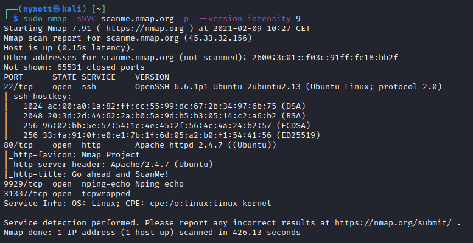
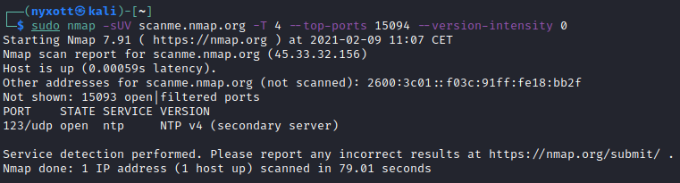
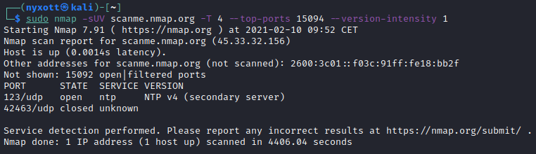

Cet article explique comment scanner les ports d'un serveur.

<!--more-->

## Introduction

La première action à réaliser durant un pentest Web est la découverte de ports.

Cela permet de connaître les services proposés par la cible.

Afin de réaliser cette tâche, il est recommandé d'utiliser [Nmap](https://nmap.org) qui est un scanner de ports libre créé par Fyodor et distribué par Insecure.org. Il est conçu pour détecter les ports ouverts, identifier les services hébergés et obtenir des informations sur le système d'exploitation d'un ordinateur distant.

Nmap propose une machine dédiée au scan. Il est donc possible de scanner le domaine [scanme.nmap.org](http://scanme.nmap.org/) à des fins de tests.

## Découvertes des ports

### TCP

Les services utilisant le protocole TCP sont les plus courants.

L'ensemble des ports du serveur cible peut être scanné en TCP via la commande suivante :
```
sudo nmap -sSVC <IP> -p- --version-intensity 9
```

Cette commande regroupe de nombreuses vérifications :
* `-sS` : Rapide et discret, le scan SYN ne termine jamais les connexions TCP et permet une différenciation fiable entre les états "ouvert", "fermé" et "filtré".
* `-sV` : Si un port ouvert est découvert, des vérifications supplémentaires seront effectuées afin de découvrir, si possible, la version exacte du service proposé par ce port.
* `-sC` : Des scripts seront automatiquement lancés en fonction de divers paramètres afin de récupérer des informations supplémentaires sur l'hôte ou sur les ports ouverts.
* `-p-` : L'ensemble des 65535 ports du serveur seront testés
* `--version-intensity 9` : La totalité des tests de détections de version seront effectués. Cela rends les tests plus long mais plus fiable




Moins d'une dizaine de minutes est nécessaire pour que le scan se termine.


### UDP

Les services utilisant le protocole UDP sont plus rarement exposés, mais il est important de tout de même les scanner.

Le scan UDP peut s'avérer extrêmement lent car, contrairement au TCP, il n'y a pas de notion de connexions. De ce fait, si un port est fermé, il faut envoyer plusieurs paquets et attendre un message indiquant explicitement que le port n'est pas accessible.

Compte tenu de cela, le scan de ports UDP ne sera pas utilisé pour vérifier la totalité des 65535 ports.

Une partie des ports du serveur cible peut être scannée en UDP via la commande suivante :
```
sudo nmap -sUV <IP> -T 4 --top-ports 15094 --version-intensity 0
```

Quelques paramètres divergent du scan TCP :
* `-sU` : Effectue un scan UDP
* `-T 4` : Effectue un scan de type "agressif" qui accélère quelque peu le scan
* `--top-ports 15 094` : Scan les 15 094 ports les plus communs
* `--version-intensity 0` : Seuls les tests de détections de version les plus courants seront effectués ce qui rend les tests excessivement moins longs


15 094 peut paraître un peu tatillon, mais c'est la valeur recommandée dans la documentation officielle de Nmap afin de couvrir 99% des cas.

De cette manière nous sommes sur à 99% d'avoir découvert tous les ports UDP potentiellement ouverts en économisant le temps de scan de 50 441 ports.







Environ une minute de scan est nécessaire pour que le scan avec l'option `--version-intensity 0` se termine, tandis qu'il faut plus d'une heure pour celui avec l'option `--version-intensity 1`.

Il est alors évident qu'un scan avec l'option `--version-intensity 9` va prendre des dizaines d'heures et n'est donc pas envisageable.


## Analyse des résultats

Dans le cas d'un serveur Web seul les ports 80 et 443 en TCP sont légitimes.

Tous les autres ports en TCP ainsi que l'ensemble des ports UDP ne sont pas censés être ouverts.
