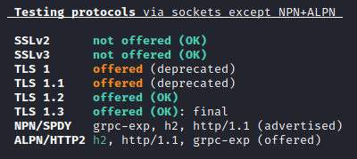
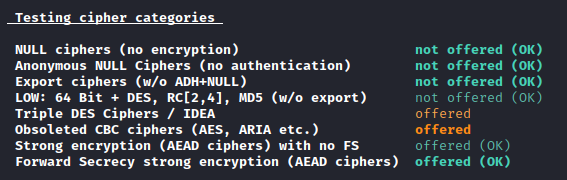
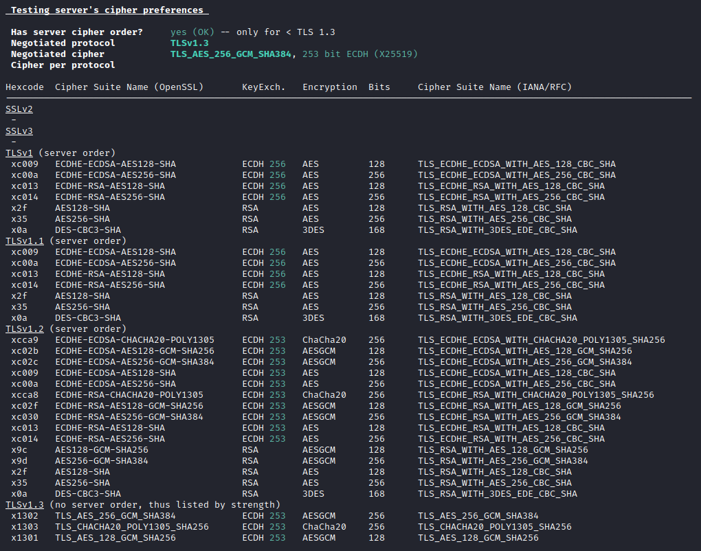
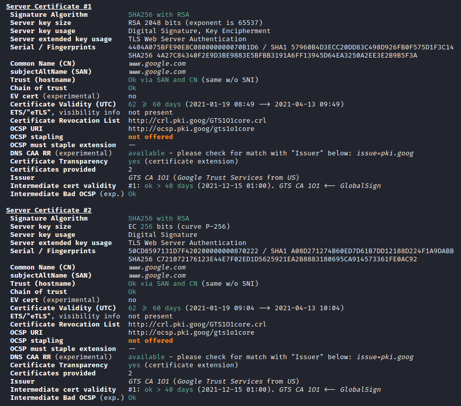
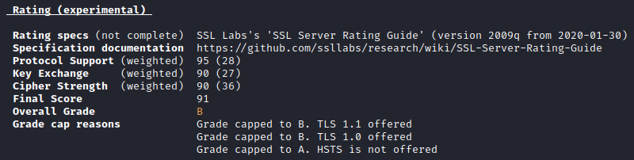

Cet article explique comment vérifier la configuration SSL/TLS d'un serveur.

<!--more-->

## Introduction

Une fois la découverte de ports effectuée (et ayant normalement dévoilée un port proposant du HTTPS dans le contexte d'un pentest Web), il est essentiel de tester la configuration SSL/TLS fourni par le serveur.

Afin de réaliser cette vérification plusieurs outils sont disponibles mais le plus complet, actuellement, est [testssl](https://github.com/drwetter/testssl.sh).

Il est possible de l'installer via cette commande :
```
git clone --depth 1 https://github.com/drwetter/testssl.sh.git testssl
```

## Scan SSL/TLS

L'outil peut être utilisé de la manière suivante :
```
testssl.sh <URL>
```

Le premier test de l'outil vérifie les versions SSL/TLS supportées par le serveur.



* `SSLv2` : Cette version a été publiée en 1995 et a été bannie en 2011
* `SSLv3` : Cette version a été publiée en 1996 et a été bannie en 2015
* `TLS 1.0` : Cette version a été publiée en 1999 et est jugée obsolète depuis 2020
* `TLS 1.1` : Cette version a été publiée en 2006 et est jugée obsolète depuis 2020
* `TLS 1.2` : Cette version a été publiée en 2008 et n'a pas encore été jugée obsolète 
* `TLS 1.3` : Cette version a été publiée en 2018 et n'a pas encore été jugée obsolète 


L'outil indique ce qui est supporté ou non, ce qui est acceptable ou non, mais également pourquoi le cas échéant.


Le second test effectué par testssl concerne les catégories de chiffrement supportés par le serveur.



* `NULL ciphers (no encryption)` : Un chiffrement de ce type n'apporte en réalité aucun chiffrement. Il mélange le contenu en clair avec du contenu inutile et se rapproche plus de la stéganographie.
* `Anonymous NULL Ciphers (no authentication)` : Ces algorithmes n'effectuent pas d'échange de clef avant de commencer à échanger des données. La légitimité du serveur ne peut donc pas être vérifiée et peut être en réalité un attaquant se faisant passer pour le serveur afin de récupérer les données.
* `Export ciphers (w/o ADH+NULL)` : Ce type de chiffrement est extrêmement faible et les données en découlant peuvent facilement être déchiffrées si elles sont récupérées
* `Low: 64 Bit + DES, RC[2, 4], MD5 (w/o expected)` : Ce type de chiffrement est faible et les données en découlant peuvent être déchiffrées si elles sont récupérées
* `Triple DES Ciphers / IDEA` : Ces algorithmes sont sujet à certaines attaques de par leur taille de blocs faible
* `Obsoleted CBC ciphers (AES, ARIA etc.)` : Ces algorithmes sont sujet à certaines attaques dû au mode de fonctionnement CBC
* `Strong encryption (AEAD ciphers) with no FS` : Ces algorithmes offrent simultanément la confidentialité, l'intégrité et l'authenticité des données tout en étant rapide
* `Forward Secrecy strong encryption (AEAD ciphers)` : Reprends les mêmes principes que "Strong encryption (AEAD ciphers)" tout en continuant d'assurer la confidentialité des données même lorsque la clef privée d'un des deux correspondant est découverte.


L'outil indique ce qui est supporté ou non et si cela est acceptable ou non.


Le test suivant concerne les suites de chiffrement utilisées par le serveur.




L'outil indique, dans l'ordre de préférence du serveur, les suites de chiffrement qui sont utilisées par ce dernier en indiquant si cela est acceptable ou non.



Les noms des suites de chiffrement respectent toujours la même nomenclature.

Ainsi, la suite de chiffrement `TLS_ECDHE_ECDSA_WITH_AES_128_CBC_SHA` peut être découpé de la manière suivante :
* `TLS` : Protocol auquel est destiné cette suite de chiffrement
* `ECDHE` : Algorithme d'échange de clefs utilisé
* `ECDSA` : Algorithme d'authentification utilisé lors de l'échange de clefs
* `AES` : Algorithme de chiffrement des paquets
* `128` : Taille de la clef utilisée pour l'algorithme de chiffrement des paquets
* `CBC` : Type de chiffrement utilisé
* `SHA` : Algorithme de hachage utilisé pour signer le message


L'avant dernier test vérifie la validité de la chaîne de confiance.




De nombreuses informations figurent ici.

Pour chaque certificat, les informations les plus importantes sont :
* `Signature Algorithm` : Algorithme utilisé pour signer le certificat
* `Issuer` : Autorité de certification ayant fourni le certificat
* `Certificate Validity (UTC)`: Lapse de temps durant lequel le certificat est valide


Enfin, la dernière vérification concerne les vulnérabilités connues.


* `Heartbleed` ([https://heartbleed.com/](https://heartbleed.com/)) : Vulnérabilité permettant à un attaquant de récupérer des informations contenues en mémoire sur le serveur. La clef privée assurant l'échange de données peut ainsi être récupérée et les communications avec les clients peuvent alors être déchiffrées.
* `CCS` ([http://ccsinjection.lepidum.co.jp/](http://ccsinjection.lepidum.co.jp/)) : Vulnérabilité permettant de forcer le client à utiliser des clefs de chiffrement faibles. Ces dernières peuvent alors être facilement retrouvées et les communications peuvent alors être déchiffrées.
* `Ticketbleed` ([https://filippo.io/ticketbleed/](https://filippo.io/ticketbleed/)) : Vulnérabilité permettant à un attaquant de récupérer des informations contenues en mémoire sur le serveur. La clef privée assurant l'échange de données peut ainsi être récupérée et les communications avec les clients peuvent alors être déchiffrées.
* `ROBOT` ([https://robotattack.org/](https://robotattack.org/)) : Vulnérabilité tirant partie des messages d'erreur TLS afin de récupérer la clef privée assurant l'échange de données. Les communications peuvent alors être déchiffrées.
* `Secure Renegociation` ([https://www.openssl.org/docs/man1.1.0/man3/SSL_get_secure_renegotiation_support.html#SECURE-RENEGOTIATION](https://www.openssl.org/docs/man1.1.0/man3/SSL_get_secure_renegotiation_support.html#SECURE-RENEGOTIATION)) : Protection empêchant un attaquant d'injecter des données lors d'une renégociation de session.
* `Secure Client-Initiated Renegotiation` ([https://wiki.crashtest-security.com/secure-client-initiated-ssl-renegotiation](https://wiki.crashtest-security.com/secure-client-initiated-ssl-renegotiation)) : Vulnérabilité permettant à un attaquant d'effectuer une renégociation de session afin d'effectuer une attaque par déni de service sur le serveur.
* `CRIME, TLS` : Vulnérabilité utilisant la compression TLS afin de déduire le contenu des communications compressées et chiffrées.
* `BREACH` ([http://breachattack.com/](http://breachattack.com/)) : Vulnérabilité utilisant le compression HTTP afin de déduire le contenu des communications compressées.
* `POODLE, SSH` : Vulnérabilité forçant le client à utiliser le protocole SSLV3 qui contient de nombreuses vulnérabilités. Les communications peuvent alors être déchiffrées.
* `TLS_FALLBACK_SCSV` ([https://wiki.openssl.org/index.php/SSL_MODE_SEND_FALLBACK_SCSV](https://wiki.openssl.org/index.php/SSL_MODE_SEND_FALLBACK_SCSV)) : Fonctionnalité permettant de se prémunir des attaques forçant le client à utiliser un protocol moins récent que celui par défaut.
* `SWEET32` ([https://sweet32.info/](https://sweet32.info/)) : Vulnérabilité tirant partie du mode de chiffrement CBC, qui est obsolète, afin de récupérer le contenu des communications chiffrées.
* `FREAK` ([https://www.digicert.com/dc/blog/freak-attack-need-know/](https://www.digicert.com/dc/blog/freak-attack-need-know/)) : Vulnérabilité tirant partie des faiblesses des suites de chiffrements "export" afin de déchiffrer les communications.
* `DROWN` ([https://drownattack.com/](https://drownattack.com/)) : Vulnérabilité permettant à un attaquant d'utiliser le protocol SSLv2 afin de récupérer la clef privée assurant l'échange de données. Les communications peuvent alors être déchiffrées.
* `LOGJAM` ([https://weakdh.org/](https://weakdh.org/)) : Vulnérabilité forcant l'utilisation des suites de chiffrement "export". Les faiblesses de ces suites de chiffrement peuvent ensuite être utilisées afin de déchiffrer les communications.
* `BEAST` ([https://en.wikipedia.org/wiki/Transport_Layer_Security#BEAST_attack](https://en.wikipedia.org/wiki/Transport_Layer_Security#BEAST_attack)) : Vulnérabilité tirant partie du mode de chiffrement CBC, qui est obsolète, afin de récupérer le contenu des communications chiffrées.
* `LUCKY13` ([https://en.wikipedia.org/wiki/Lucky_Thirteen_attack](https://en.wikipedia.org/wiki/Lucky_Thirteen_attack)) : Vulnérabilité tirant partie du mode de chiffrement CBC, qui est obsolète, afin de récupérer le contenu des communications chiffrées.
* `Winshock` ([https://www.digicert.com/dc/blog/winshock-vulnerability/](https://www.digicert.com/dc/blog/winshock-vulnerability/)) : Vulnérabilité de heap overflow, dans la DLL "schannel", permettant d'exécuter du code arbitraire à distance.
* `RC4` ([https://www.rc4nomore.com/](https://www.rc4nomore.com/)) : Vulnérabilité tirant partie des faiblesses de la suite de chiffrement RC4 afin de déchiffrer les communications.


L'outil indique si la configuration SSL/TLS est sujette à des vulnérabilités connues ou non.


## Analyse des résultats

L'outil attribue une note globale suivant le niveau de configuration SSL/TLS proposé par le serveur.



De manière générale, testssl va indiquer en vert ce qui est correct, en orange ce qu'il vaut mieux éviter et en rouge ce qu'il faut absolument éviter.

Globalement, les versions SSL/TLS qui ne sont plus supportées ainsi que les chiffrements obsolètes ne doivent pas être proposés. En outre, le ou les certificat(s) doivent être valides de par leur algorithme de signature, la validité de leur émetteur ainsi que la validité de leur date.
