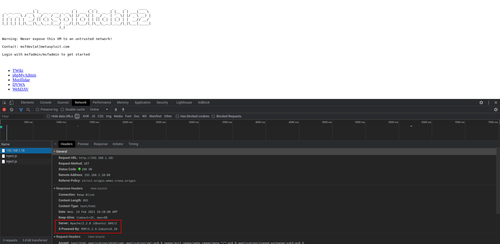
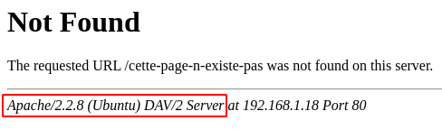

Cet article explique comment identifier des divulgations d'informations techniques

<!--more-->

## Introduction

Une des premières vulnérabilités pouvant être facilement identifiée, sur un site Web, est la divulgation d'informations techniques.

Elle se traduit principalement au travers de mauvaises configurations ou de mauvaises gestions des messages d'erreurs et divulgue ainsi les technologies (et parfois leur version) constituant l'environnement du site Web.

Bien que ces informations semblent être d'une utilité limitée, elles permettent d'orienter les attaques. En effet, il est possible de rechercher si des vulnérabilités connues impact ses technologies et/ou de surveiller les nouvelles vulnérabilités les impactants.

## Identification de divulgations d'informations techniques

Il est possible de récupérer des informations tels que le serveur et le langage utilisé ainsi que leur version via les en-têtes HTTP.

Il est possible de récupérer le serveur ainsi que sa version en cherchant volontairement une page inconnue.

Il est possible de récupérer des stack traces en renseignant des informations inattendues qui ne sont pas gérées par l'application. Ces stack traces donnent des informations sur les technologies utilisées ainsi que des chemins absolus et parfois des bouts de codes.


De multiples autres cas de figures peuvent survenir mais les 3 suivants sont les plus courants.


## Analyse des résultats

Toutes divulgations d'informations techniques constituent une vulnérabilité.
